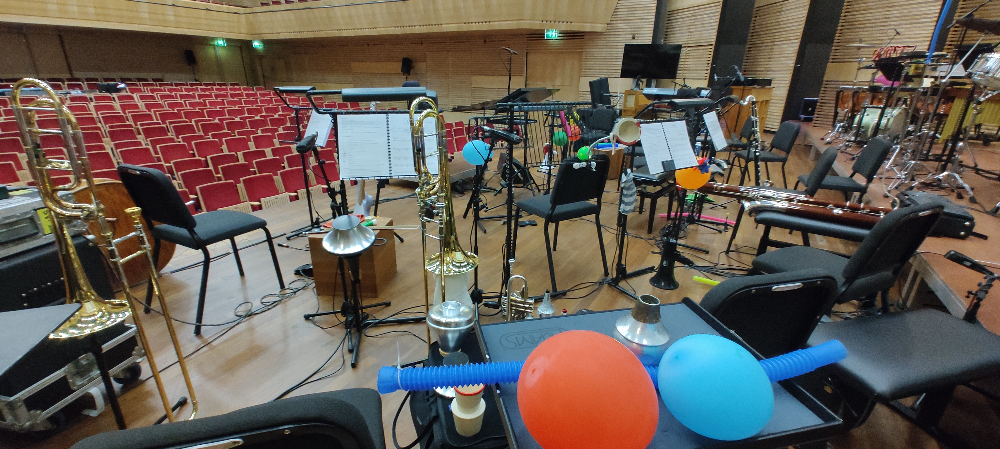

Today the Muziekgebouw played host to a mesmerizing performance called _O táxi n.º 9297_. It was an orchestral narration that weaved through the silent film of the same name, a masterpiece dating back to 1927.

<!--more-->

As all-around sound engineer, my role spanned the breadth of this auditory spectacle, from the load-in and setup on April 2 to ensuring every note and sound effect hit the mark during rehearsals and the live performance.

*The calm before the score: Setting the stage for 'O táxi n.º 9297' at the Muziekgebouw.*

Connecting around 20 microphones, each one destined to capture the unique timbre of instruments like trumpets, clarinets, bassoons, the velvety touch of marimbas, and a whole universe of percussion, was no small feat. It was a task matched only by the talent of the musicians I had the pleasure to work with.

Their talent was something to behold. As they wielded an eclectic mix of props for foley – the art of creating live sound effects – the musicians truly brought the film to life, crafting an immersive soundscape that transported us all back to the roaring '20s.

<https://www.muziekgebouw.nl/nl/agenda/12645/o-taxi-n-o-9297>