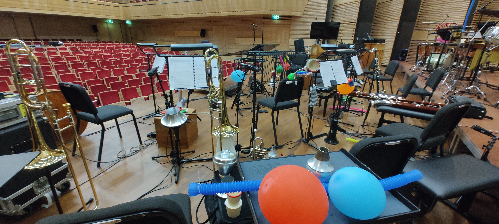

Vandaag was het Muziekgebouw het toneel van een betoverende voorstelling genaamd _O táxi n.º 9297_. Het was een orkestrale vertelling die verweven was met de gelijknamige stomme film, een meesterwerk uit 1927.

<!--more-->

Als allround geluidstechnicus omvatte mijn rol het volledige spectrum van dit auditieve spektakel, van de load-in en opbouw op 2 april tot het zorgen dat elke noot en elk geluidseffect perfect overkwam tijdens repetities en de live voorstelling.

*De stilte voor de muzikale storm: Het klaarmaken van het podium voor 'O táxi n.º 9297' in het Muziekgebouw.*

Het aansluiten van ongeveer 20 microfoons, elk bestemd om de unieke klankkleur van instrumenten zoals trompetten, klarinetten, fagotten, de fluweelachtige toon van marimba's en een heel universum aan percussie vast te leggen, was bepaald geen kleinigheid. Het was een taak die alleen geëvenaard werd door het talent van de musici met wie ik het genoegen had samen te werken.

Hun vakmanschap was indrukwekkend. Terwijl ze een eclectische mix van rekwisieten hanteerden voor foley – de kunst van het creëren van live geluidseffecten – brachten de musici de film echt tot leven en creëerden ze een meeslepend geluidslandschap dat ons allemaal terugvoerde naar de bruisende jaren '20.

Het zijn klussen als deze, waar techniek traditie ontmoet en waar elke geluidsgolf een draad is in het weefsel van een lang vervlogen tijdperk, die me herinneren waarom ik verliefd werd op geluidstechniek. Elke microfooncheck, elke kabelverbinding, elke soundcheck – het is allemaal onderdeel van de magie.

<https://www.muziekgebouw.nl/nl/agenda/12645/united-instruments-of-lucilin/o-taxi-n-o-9297-1927>